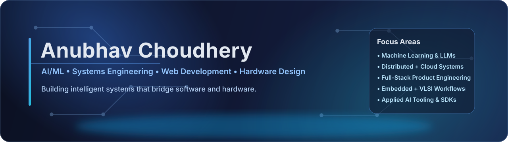

  

  <!-- Replace 'anubhav-ch' with your actual GitHub username if different to see streak stats -->
  

---

## About Me

I am an **engineering enthusiast and builder**, currently pursuing a **Bachelor of Science in Computer Engineering and Computer Science** at the **University of Wisconsin-Madison**.

My interests span across **AI/ML, Systems Engineering, Hardware Design, and Full-Stack Development**. I am particularly passionate about **Machine Learning, LLMs, Embedded Systems, VLSI Design, and Distributed Computing**—anything that involves tackling **complex technical problems** with **precision and creativity**.

Whether it's **developing AI-powered applications, designing digital systems, or building scalable web platforms**, I thrive on **creating solutions that bridge hardware and software** to solve real-world problems. My long-term goal is to **leverage technology to build impactful products** that push boundaries.

---

## Recent Work (Projects, Products, and Libraries)

### Cybersec-Scanner - Privacy-First Security Library | [PyPI](https://pypi.org/project/cybersec-scanner/) | [Repo](https://github.com/JaiAnshSB26/cybersec-scanner)
**Python • Ollama • Mitmproxy • Git**

- Developed privacy-first Python Library/SDK for efficient and safe software development.
- **Tech Stack**: Python | Ollama | Mitmproxy | Git

---

### JBAC AI Trading Coach - AI-Powered Trading Assistant | [Link](https://trading.jbac.dev) | [Repo](https://github.com/JaiAnshSB26/JBAC_AI_Trading_Coach_Public)
**Python • AWS • yfinance • FastAPI**

- Developed an **AI-powered trading assistant** that provides **personalized strategy advice** and market insights.
- **Tech Stack:** Python | AWS | yfinance | FastAPI

---

### YtQGen - Video-to-Questionnaire Library | [PyPI](https://pypi.org/project/ytqgen) | [Repo](https://github.com/JaiAnshSB26/YtQGen_Public)
**Python • LLM APIs • yt-dlp • PyAV**

- Built a **Python Library/SDK** that generates **questionnaires from YouTube videos** using AI.
- **Tech Stack:** Python | LLM APIs | yt-dlp | PyAV

---

### EZ-Chess - Explainable Chess Analysis | [PyPI](https://pypi.org/project/ez-chess/) | [Repo](https://github.com/JaiAnshSB26/EZ-Chess)
**Python • LLMs • MCP • Stockfish • Tkinter • Groq/Ollama**

- Created an **explainable chess analysis tool** using LLMs with **MCP-style tooling** (Stockfish analysis, Lichess API).
- **Tech Stack:** Python | LLMs | MCP | Stockfish | Tkinter | Groq/Ollama

---

### Edu QGen - Educational Questionnaire Generator | [Live](https://questionnaire.jbac.dev/)
**Python • GCP • React • FastAPI • Linux/Ubuntu**

- Built a system that generates **educational questionnaires** from user-uploaded videos.
- **Tech Stack:** Python | GCP | React | FastAPI | Linux/Ubuntu

---

### AI-Powered Job Search Assistant
**Python • Web Scraping • Gradio • IBM Watsonx**

- Engineered an **intelligent job search platform** that matches candidates with opportunities using AI.
- **Tech Stack:** Python | Web Scraping | Gradio | IBM Watsonx

---

## Skills, Technologies & Competencies

### Languages

  

---

### AI / ML & Data Science

  
  
  
  
  
  
  
  
  
  
  
  
  
  

---

### Web Development

  

---

### Automation & DevOps

  
  
  
  

---

### Visualization & UI

  
  
  
  
  
  

---

### Embedded & Hardware

  
  
    
    
    
    
    
    
    

---

## Connect

- **LinkedIn**: [linkedin.com/in/anubhav-ch](https://linkedin.com/in/anubhav-ch)
- **Email**: [anubhavchoudhery@gmail.com](mailto:anubhavchoudhery@gmail.com)
- **Portfolio**: [anubhavc.me](https://anubhavc.me)

---

  *"The best way to predict the future is to invent it."*

